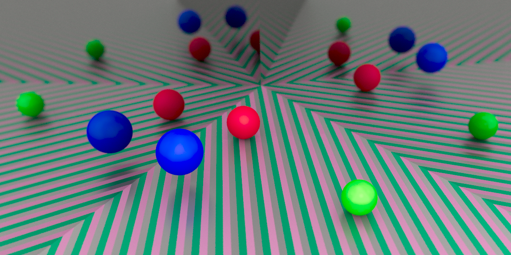
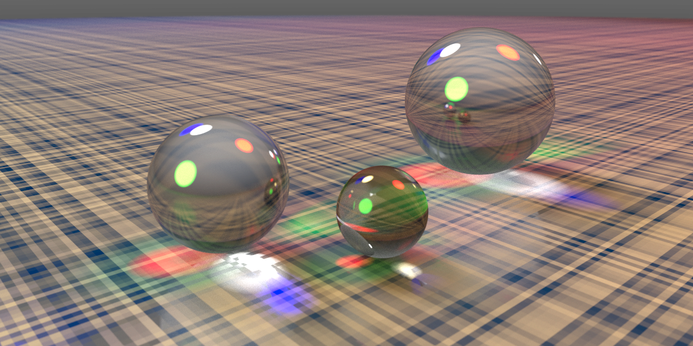
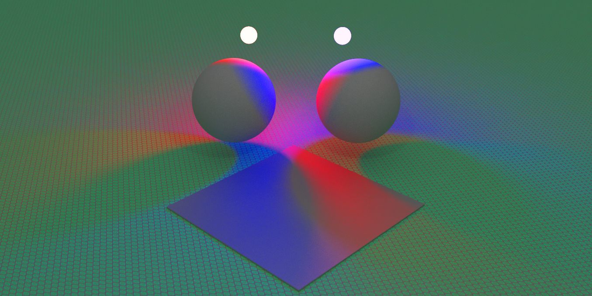
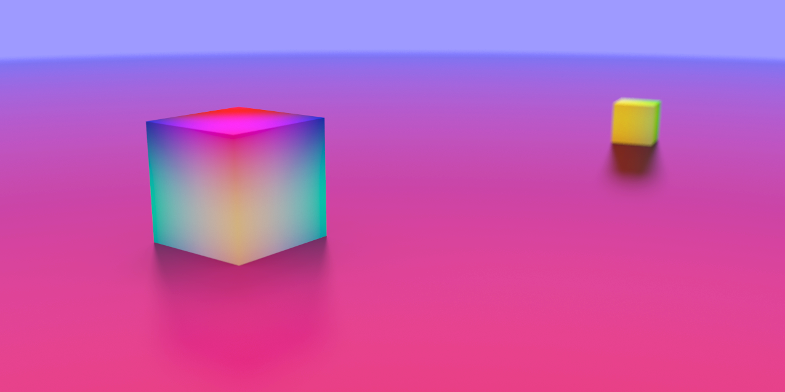

The implementation of the ray tracing backward method made it possible to simulate various optical effects: global illumination, the Fresnel effect, complex shadows, secondary reflections, refraction, caustics, and depth of field.

  
  
  
  

